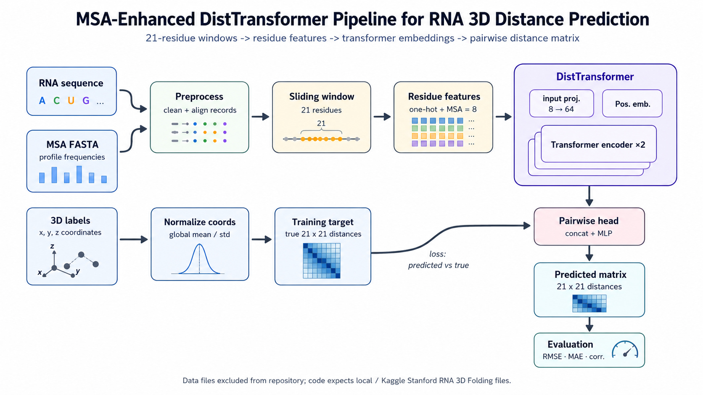
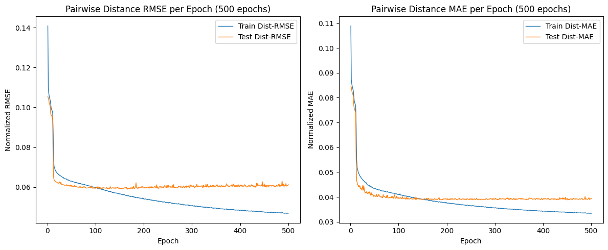
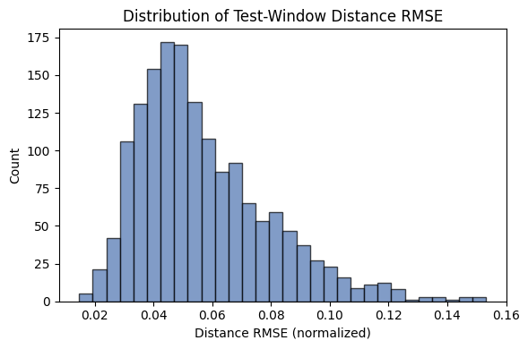
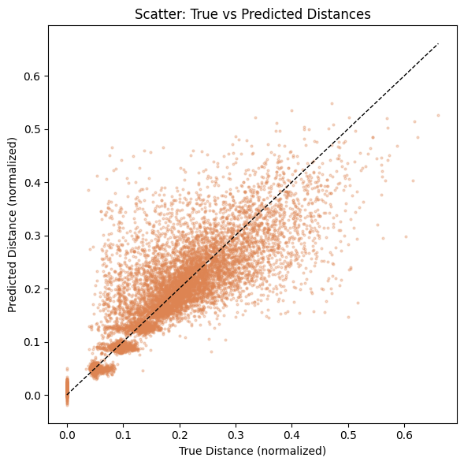
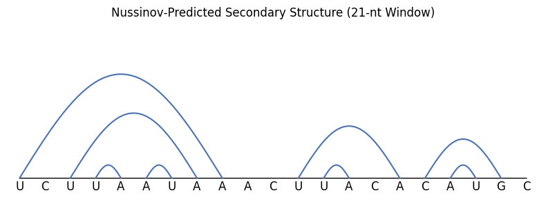

# RNA 3D Folding with MSA-Enhanced DistTransformer

A production-structured PyTorch project for predicting local RNA 3D geometry from sequence and multiple-sequence-alignment features.

The core model, `DistTransformer`, predicts a **21 × 21 pairwise distance matrix** for local RNA residue windows. Each input window contains 21 nucleotides and each nucleotide is represented by an 8-dimensional feature vector: 4 nucleotide one-hot features and 4 MSA profile-frequency features.

---

## Project summary

RNA molecules fold into 3D structures that determine their biological function. This project converts the original experimental notebook into a reusable machine-learning pipeline for local RNA 3D distance prediction.

The pipeline:

1. Loads RNA sequences, residue-level 3D coordinates, and MSA FASTA files.
2. Builds local 21-residue windows around each residue.
3. Encodes every position as one-hot nucleotide identity plus MSA profile frequencies.
4. Normalizes 3D coordinates and converts them into pairwise distance matrices.
5. Trains a Transformer encoder with a pairwise MLP head.
6. Reports RMSE, MAE, per-window errors, Pearson correlation, and diagnostic plots.

<p align="center">
  
</p>

<p align="center"><em>Fig. 1. End-to-end project architecture from RNA sequence, MSA profile, and 3D coordinate labels to local pairwise distance prediction and evaluation.</em></p>

---

## Repository structure

```text
rna-3d-folding-disttransformer/
├── configs/
│   └── default.yaml
├── data/
│   └── README.md
├── docs/
│   ├── github_push_guide.md
│   └── methodology.md
├── notebooks/
│   └── original_rna_3d_folding_experiment.ipynb
├── reports/
│   └── figures/             # README figures and architecture diagram
├── results/
│   ├── metrics_summary.csv
│   ├── metrics_summary.json
│   └── training_history_from_notebook.csv
├── scripts/
│   ├── evaluate.py
│   ├── plot_nussinov_example.py
│   └── train.py
├── src/
│   └── rna3d_folding/
├── tests/
├── requirements.txt
├── pyproject.toml
└── README.md
```

---

## Dataset

The dataset is **not included** because the files are large and should not be committed to GitHub.

Use the Kaggle dataset here:

**Stanford RNA 3D Folding**  
https://www.kaggle.com/competitions/stanford-rna-3d-folding/data

Expected local layout:

```text
data/
├── train_labels.v2.csv
├── train_sequences.xlsx        # train_sequences.csv is also supported
└── MSA/
    ├── <target_id>.MSA.fasta
    └── ...
```

On Kaggle, you can also pass the mounted input directory directly:

```bash
python -m rna3d_folding.train \
  --data-dir /kaggle/input/stanford-rna-3d-folding/stanford-rna-3d-folding \
  --output-dir outputs
```

---

## Installation

Create and activate a virtual environment:

```bash
python -m venv .venv
```

Windows:

```bash
.venv\Scripts\activate
```

macOS/Linux:

```bash
source .venv/bin/activate
```

Install the project:

```bash
pip install -e .
```

For development tools:

```bash
pip install -e ".[dev]"
```

---

## Training

Default configuration is stored in `configs/default.yaml`.

Run training:

```bash
python -m rna3d_folding.train --data-dir data --output-dir outputs
```

Run a faster smoke experiment:

```bash
python -m rna3d_folding.train \
  --data-dir data \
  --output-dir outputs/smoke_test \
  --epochs 5 \
  --sample-size 500
```

The training command saves:

```text
outputs/
├── checkpoints/
│   └── best_model.pt
├── figures/
│   ├── training_curves.png
│   ├── rmse_distribution.png
│   └── true_vs_predicted.png
├── metrics.json
└── training_history.csv
```

---

## Evaluation

Evaluate a saved checkpoint:

```bash
python -m rna3d_folding.evaluate \
  --checkpoint outputs/checkpoints/best_model.pt \
  --data-dir data \
  --output-dir outputs/evaluation
```

---

## Model architecture

```text
Input: 21 × 8 feature matrix
  ↓
Linear projection: 8 → 64
  ↓
Learned positional embedding
  ↓
2-layer Transformer encoder
  ↓
Pairwise residue embedding concatenation
  ↓
MLP distance head
  ↓
Output: symmetric 21 × 21 pairwise distance matrix
```

Default hyperparameters:

| Parameter | Value |
|---|---:|
| Window radius | 10 |
| Window length | 21 |
| Input features per residue | 8 |
| Transformer dimension | 64 |
| Attention heads | 8 |
| Transformer layers | 2 |
| Feed-forward dimension | 128 |
| Dropout | 0.1 |
| Optimizer | AdamW |
| Learning rate | 3e-4 |
| Weight decay | 1e-5 |
| Batch size | 64 |
| Sampled training windows | 8,000 |

---

## Reported notebook results

The following results are preserved from the original notebook run. The experiment used an 8,000-window sampled subset, 21-residue windows, globally standardized coordinates, and an 80/20 train-test split.

| Experiment | Final Train RMSE | Final Test RMSE | Final Train MAE | Final Test MAE | Test Window RMSE Mean | Test Window MAE Mean | Pearson Corr. |
|---|---:|---:|---:|---:|---:|---:|---:|
| DistTransformer, 100 epochs | 0.0600 | 0.0611 | 0.0411 | 0.0401 | 0.0574 | 0.0401 | 0.8253 |
| DistTransformer, 500 epochs | 0.0469 | 0.0612 | 0.0335 | 0.0394 | 0.0569 | 0.0394 | 0.8248 |

The 500-epoch run improves training error but does not materially improve test RMSE over the 100-epoch run, suggesting mild overfitting after the model has already converged.

---

## Visual results

The README directly displays the main figures exported from the original notebook. These images are stored under `reports/figures/`, so they render automatically on GitHub.

### Training behaviour

<p align="center">
  
</p>

<p align="center"><em>Fig. 2. RMSE and MAE curves for the 500-epoch DistTransformer experiment.</em></p>

### Error distribution

<p align="center">
  
</p>

<p align="center"><em>Fig. 3. Test-window RMSE distribution for local RNA distance-matrix prediction.</em></p>

### Predicted versus true distances

<p align="center">
  
</p>

<p align="center"><em>Fig. 4. Predicted pairwise distances plotted against true normalized pairwise distances.</em></p>

### Secondary-structure baseline visualization

<p align="center">
  
</p>

<p align="center"><em>Fig. 5. Nussinov dynamic-programming arc diagram included as a lightweight secondary-structure baseline visualization.</em></p>

Historical 100-epoch versions are also included for comparison:

- `training_curves_100_epoch.png`
- `rmse_distribution_100_epoch.png`
- `true_vs_predicted_100_epoch.png`
- `nussinov_arc_diagram_100_epoch.png`

---

## Secondary-structure baseline

The project includes a simple Nussinov dynamic-programming baseline for dot-bracket prediction and arc-diagram visualization.

Run:

```bash
python scripts/plot_nussinov_example.py
```

This saves:

```text
outputs/figures/nussinov_example.png
```

---

## Testing

Run the included tests:

```bash
pytest -q
```

---

## Push to GitHub

After unzipping this folder inside your empty repository directory:

```bash
git init
git branch -M main
git add .
git commit -m "Initial commit: add RNA 3D folding DistTransformer pipeline"
git remote add origin https://github.com/<your-username>/<your-repo-name>.git
git push -u origin main
```

Recommended repository description:

```text
MSA-enhanced Transformer pipeline for RNA 3D local pairwise distance prediction using the Stanford RNA 3D Folding dataset.
```

Suggested GitHub topics:

```text
rna-3d-folding deep-learning pytorch transformer bioinformatics computational-biology kaggle
```

---

## Notes

- The repository intentionally excludes dataset files, trained checkpoints, and generated outputs through `.gitignore`.
- The original notebook is preserved under `notebooks/` for traceability.
- The reusable implementation lives under `src/rna3d_folding/`.
- The project is suitable as a research-style GitHub portfolio project because it includes methodology, modular code, reproducible configuration, tests, figures, and reported results.
